```mermaid
flowchart LR
    A["User message"] --> B{"🛡️ Input Guardrail"}
    B -->|"Contains PII?"| C["⛔ BLOCKED\nTripwire triggered"]
    B -->|"Clean input"| D["✅ Agent processes\nnormally"]
    D --> E{"🛡️ Output Guardrail"}
    E -->|"Promises refund?"| F["⛔ BLOCKED\nRetry without promise"]
    E -->|"Safe response"| G["✅ Sent to user"]

    style C fill:#ef4444,color:#fff
    style F fill:#ef4444,color:#fff
    style G fill:#22c55e,color:#fff
```

# Module 2: The "Brain" — Pydantic + PydanticAI + OpenAI Agents SDK

> **Goal**: Understand data validation, build your first AI agent, and learn two frameworks for agent development.
> **Time**: Week 3–4 | **Watch alongside**: Videos 2.1–2.9 from curated resources

---

## 🎯 What & Why

This module has **3 layers**, each building on the previous:

```mermaid
flowchart TB
    A["🔧 Pydantic\n(Data Validation)"] --> B["🤖 PydanticAI\n(AI Agent Framework)"]
    A --> C["🛡️ OpenAI Agents SDK\n(AI Agent Framework)"]
    B --> D["You pick which to use\nfor your projects"]
    C --> D

    style A fill:#7c3aed,color:#fff
    style B fill:#06b6d4,color:#fff
    style C fill:#10b981,color:#fff
```



| Layer | What it is | Analogy |
|-------|-----------|---------|
| **Pydantic** | Validates data (ensures correct types, formats) | A **customs inspector** checking every package at the border |
| **PydanticAI** | Framework for building AI agents using Pydantic | A **smart intern** with instructions, tools, and validated outputs |
| **OpenAI Agents SDK** | Another framework for AI agents, with handoffs and guardrails | A **call center** with specialized agents and safety rules |

> **Why learn both frameworks?** In interviews, you'll be asked: *"Why did you choose PydanticAI over the Agents SDK?"* You need to have used both to answer intelligently.

---

## Part 1: Pydantic — The Foundation

---

### 🧠 What is data validation?

When your AI agent gets data — from a user, an API, or an LLM — it arrives as raw, unstructured data. Without validation, bad data causes silent bugs:

```python
# ❌ The nightmare: raw dictionaries
user = {"name": "Koushik", "age": "twenty-five"}  # age should be int!

def greet(user: dict):
    birth_year = 2026 - user["age"]  # 💥 TypeError: unsupported operand
    return f"Hi {user['name']}, born in {birth_year}"

# This crashes at RUNTIME, not when you write the code.
# In a production agent, this means failed customer requests.
```

```python
# ✅ The solution: Pydantic validates on creation
from pydantic import BaseModel

class User(BaseModel):
    name: str
    age: int  # Pydantic will REJECT "twenty-five" here

user = User(name="Koushik", age="25")  # ✅ Auto-converts "25" → 25
user = User(name="Koushik", age="twenty-five")  # ❌ ValidationError (caught!)
```



```mermaid
flowchart LR
    A["Raw Input\n{'age': 'twenty-five'}"] --> B{"Pydantic\nBaseModel"}
    B -->|"Type coercion OK\n'25' → 25"| C["✅ Valid User object"]
    B -->|"Can't convert\n'twenty-five'"| D["❌ ValidationError\n(caught immediately!)"]
```

### 🧠 BaseModel — Your First Model

```python
from pydantic import BaseModel, Field

class AgentResponse(BaseModel):
    """A model that describes what an AI agent should return"""

    answer: str = Field(
        description="The agent's answer to the user's question"
    )
    confidence: float = Field(
        ge=0.0,  # ge = greater than or equal
        le=1.0,  # le = less than or equal
        description="How confident the agent is (0.0 to 1.0)"
    )
    sources: list[str] = Field(
        default_factory=list,  # Default: empty list
        description="URLs the agent used to find the answer"
    )

# ✅ Create with valid data
response = AgentResponse(
    answer="Python 3.12 is the latest stable version",
    confidence=0.95,
    sources=["https://python.org"]
)
print(response.answer)        # "Python 3.12 is the latest stable version"
print(response.confidence)    # 0.95
print(response.model_dump())  # Convert to dict (for JSON APIs)

# ❌ Invalid data caught immediately
response = AgentResponse(
    answer="something",
    confidence=1.5,  # 💥 ValidationError: confidence must be ≤ 1.0
    sources=["url"]
)
```

### 🧠 Validators — Custom Rules

Sometimes type checking isn't enough. Validators let you add **business logic**:

```python
from pydantic import BaseModel, field_validator

class CustomerQuery(BaseModel):
    email: str
    question: str
    priority: str

    @field_validator("email")
    @classmethod
    def email_must_be_valid(cls, v: str) -> str:
        if "@" not in v:
            raise ValueError("Invalid email address")
        return v.lower()  # Normalize to lowercase

    @field_validator("priority")
    @classmethod
    def priority_must_be_known(cls, v: str) -> str:
        allowed = {"low", "medium", "high", "critical"}
        if v.lower() not in allowed:
            raise ValueError(f"Priority must be one of: {allowed}")
        return v.lower()

# ✅ Valid — email gets lowercased automatically
query = CustomerQuery(
    email="Koushik@Gmail.COM",
    question="Why is my order late?",
    priority="HIGH"
)
print(query.email)     # "koushik@gmail.com" (lowered!)
print(query.priority)  # "high" (lowered!)

# ❌ Caught: invalid email
query = CustomerQuery(email="not-an-email", question="hi", priority="low")
# ValidationError: Invalid email address
```

### 🧠 Nested Models

Real-world data has **layers**. Pydantic handles nesting naturally:

```python
from pydantic import BaseModel

class ToolCall(BaseModel):
    tool_name: str
    arguments: dict[str, str]

class AgentStep(BaseModel):
    thought: str
    action: ToolCall | None = None  # Agent might not call a tool

class AgentResult(BaseModel):
    steps: list[AgentStep]
    final_answer: str
    total_tokens: int

# Create a full agent result
result = AgentResult(
    steps=[
        AgentStep(
            thought="I need to search for the weather",
            action=ToolCall(
                tool_name="get_weather",
                arguments={"city": "Chicago"}
            )
        ),
        AgentStep(
            thought="Now I have the data, I can answer",
            action=None
        ),
    ],
    final_answer="It's 72°F in Chicago",
    total_tokens=1500,
)

# Access nested data cleanly
print(result.steps[0].action.tool_name)  # "get_weather"
```


---

## Part 2: PydanticAI — Your First AI Agent

---

### 🧠 What is an AI agent?

An AI agent is **NOT** just a chatbot. Here's the difference:

| | Chatbot | AI Agent |
|---|---------|----------|
| **Does** | Responds to messages | **Takes actions** to achieve goals |
| **Has** | Predefined responses | **Tools** it can call (APIs, databases) |
| **Thinks** | Not really | **Reasons** about which tools to use and when |
| **Outputs** | Free text (messy) | **Structured data** (validated by Pydantic) |

**The "Smart Intern" Analogy:**

> Imagine hiring an intern. You give them:
>
> 1. **Instructions** (system prompt) — "You're a customer support agent. Be helpful but never promise refunds."
> 2. **Tools** (functions) — Access to order lookup, account status check
> 3. **Judgment** (LLM) — They decide WHICH tool to use based on the question
> 4. **Report template** (structured output) — Their response must follow a specific format, not free text

That's exactly what PydanticAI builds.

### 🧠 The Agent Loop

When you run a PydanticAI agent, this loop happens automatically:

```mermaid
flowchart TB
    A["1. User sends message"] --> B["2. LLM receives message\n+ system prompt\n+ available tools"]
    B --> C{"3. LLM decides"}
    C -->|"Needs more info"| D["4a. Call a Tool\n(e.g., search_web)"]
    D -->|"Tool returns result"| B
    C -->|"Ready to answer"| E["5. Generate final output"]
    E --> F["6. Pydantic validates output\nagainst your model"]
    F -->|"Valid"| G["✅ Return result"]
    F -->|"Invalid"| B

    style A fill:#7c3aed,color:#fff
    style G fill:#22c55e,color:#fff
```



**Key insight**: The agent can call tools **multiple times** before answering. It loops until it has enough information.

### 🧠 Your First PydanticAI Agent (10 lines)

```python
from pydantic_ai import Agent

# Create an agent — that's it!
agent = Agent(
    model="openai:gpt-4o",           # Which LLM to use
    system_prompt="You are a helpful assistant that answers questions concisely.",
)

# Run it (synchronously for simplicity)
result = agent.run_sync("What is the capital of France?")
print(result.output)  # "Paris"
```

**Let's break down what just happened:**

1. `Agent(...)` — Created an agent with a model and instructions
2. `run_sync(...)` — Sent a user message, waited for the response
3. `result.output` — The agent's response (plain string by default)

### 🧠 Structured Outputs — The Real Power

Plain text output is **dangerous** in production:

```python
# ❌ Unstructured — what format is this? Can we parse it reliably?
result = agent.run_sync("What cities is it raining in?")
print(result.output)
# "It's raining in Chicago, New York, and Seattle today."
# Good luck extracting city names from this consistently!

# ✅ Structured — guaranteed format with Pydantic
from pydantic import BaseModel

class WeatherReport(BaseModel):
    cities_with_rain: list[str]
    temperature_f: float
    summary: str

agent = Agent(
    model="openai:gpt-4o",
    output_type=WeatherReport,  # ← Forces structured output
    system_prompt="Report weather data for US cities.",
)

result = agent.run_sync("What's the weather in Chicago?")
print(result.output.cities_with_rain)  # ["Chicago"]
print(result.output.temperature_f)     # 72.0
print(result.output.summary)           # "Partly cloudy with rain..."
# Now you can use these values in code — reliably!
```



```mermaid
flowchart LR
    A["User: 'What's the weather?'"] --> B["LLM generates\nstructured response"]
    B --> C{"Pydantic validates\nagainst WeatherReport"}
    C -->|"✅ Valid"| D["WeatherReport\ncities_with_rain: ['Chicago']\ntemperature_f: 72.0"]
    C -->|"❌ Invalid"| E["Retry: ask LLM again\nwith error feedback"]
    E --> B
```

### 🧠 Tools — Giving Your Agent Abilities

Without tools, an agent can only use knowledge from its training data. **Tools let it DO things:**

```python
from pydantic_ai import Agent, RunContext
from pydantic import BaseModel
import httpx

class WeatherResult(BaseModel):
    city: str
    temperature_f: float
    condition: str

agent = Agent(
    model="openai:gpt-4o",
    output_type=WeatherResult,
    system_prompt="You are a weather assistant. Use the get_weather tool to find real-time weather.",
)

# Define a tool the agent can call
@agent.tool
async def get_weather(ctx: RunContext[None], city: str) -> str:
    """Get the current weather for a city.

    Args:
        city: The city name to check weather for.
    """
    # In a real app, this would call a weather API
    # For learning, we'll return mock data
    weather_data = {
        "Chicago": "72°F, Partly Cloudy",
        "New York": "68°F, Rainy",
        "Seattle": "58°F, Overcast",
    }
    return weather_data.get(city, f"Weather data not available for {city}")

# The agent DECIDES to call get_weather, you don't tell it to
result = agent.run_sync("What's the weather in Chicago?")
print(result.output)
# WeatherResult(city='Chicago', temperature_f=72.0, condition='Partly Cloudy')
```



```mermaid
sequenceDiagram
    participant User
    participant Agent as PydanticAI Agent
    participant LLM as GPT-4o
    participant Tool as get_weather()

    User->>Agent: "What's the weather in Chicago?"
    Agent->>LLM: User message + system prompt + available tools
    LLM->>Agent: "I should call get_weather(city='Chicago')"
    Agent->>Tool: get_weather("Chicago")
    Tool-->>Agent: "72°F, Partly Cloudy"
    Agent->>LLM: Here's the tool result, now answer the user
    LLM->>Agent: WeatherResult(city="Chicago", temp=72.0, ...)
    Agent->>Agent: Pydantic validates ✅
    Agent-->>User: Validated WeatherResult
```

### 🧠 Dependencies — Injecting Context

Real agents need access to databases, API clients, and user sessions. PydanticAI uses **dependency injection** to provide these cleanly:

```python
from dataclasses import dataclass
from pydantic_ai import Agent, RunContext

# Define what your agent needs access to
@dataclass
class SupportDeps:
    customer_id: str
    db_connection: object  # Your database client
    is_premium: bool

agent = Agent(
    model="openai:gpt-4o",
    deps_type=SupportDeps,  # ← Agent knows what deps to expect
    system_prompt="You are a customer support agent.",
)

@agent.tool
async def lookup_order(ctx: RunContext[SupportDeps], order_id: str) -> str:
    """Look up an order for the current customer."""
    # Access dependencies through ctx.deps
    customer_id = ctx.deps.customer_id
    is_premium = ctx.deps.is_premium

    # In real code: query database using ctx.deps.db_connection
    return f"Order {order_id} for customer {customer_id} (premium: {is_premium})"

# Run with dependencies
deps = SupportDeps(
    customer_id="CUST-123",
    db_connection=None,  # Would be real DB in production
    is_premium=True,
)
result = agent.run_sync("Where is my order ORD-456?", deps=deps)
```

**Why not just use global variables?** Dependencies make your agent **testable**. In tests, you inject mock deps. In production, you inject real ones. Same code, different context.

---

## Part 3: OpenAI Agents SDK — The Alternative

---

### 🧠 Why learn another framework?

| | PydanticAI | OpenAI Agents SDK |
|---|-----------|-------------------|
| **Strength** | Type-safety, model-agnostic | Multi-agent handoffs, guardrails |
| **Feels like** | FastAPI for agents | Express.js for agents |
| **Best for** | Single agent, strict outputs | Multi-agent systems |
| **LLM support** | Any (OpenAI, Gemini, Claude, etc.) | Any (despite the name) |
| **Community** | Growing (Pydantic team) | Large (OpenAI backing) |

### 🧠 The Agent Loop (SDK Version)

The SDK's agent loop is similar but with **handoffs** and **guardrails** built in:

```mermaid
flowchart TB
    A["1. User message"] --> IG{"Input\nGuardrails"}
    IG -->|"❌ Blocked"| Z["⛔ Rejected\n(e.g., profanity)"]
    IG -->|"✅ Passed"| B["2. LLM processes"]
    B --> C{"3. LLM decides"}
    C -->|"Call tool"| D["4a. Execute tool"]
    D --> B
    C -->|"Handoff"| E["4b. Transfer to\nanother agent"]
    E --> B
    C -->|"Final output"| OG{"Output\nGuardrails"}
    OG -->|"❌ Blocked"| B
    OG -->|"✅ Passed"| G["✅ Return to user"]

    style Z fill:#ef4444,color:#fff
    style G fill:#22c55e,color:#fff
    style IG fill:#f59e0b,color:#000
    style OG fill:#f59e0b,color:#000
```



### 🧠 Your First SDK Agent

```python
from agents import Agent, Runner

# Create a simple agent
agent = Agent(
    name="Assistant",
    instructions="You are a helpful assistant. Answer questions concisely.",
)

# Run it
result = Runner.run_sync(agent, "What is the capital of France?")
print(result.final_output)  # "Paris"
```

### 🧠 Handoffs — Agent-to-Agent Delegation

This is the SDK's killer feature. Imagine a **customer support call center**:

```python
from agents import Agent, Runner

# Specialist agents
billing_agent = Agent(
    name="Billing Specialist",
    instructions="""You handle billing questions ONLY.
    You can check invoices, explain charges, and process payment issues.
    If the question isn't about billing, transfer back to triage.""",
)

tech_agent = Agent(
    name="Technical Support",
    instructions="""You handle technical issues ONLY.
    You can troubleshoot errors, explain features, and guide setup.
    If the question isn't technical, transfer back to triage.""",
)

# Triage agent — the "receptionist" that routes queries
triage_agent = Agent(
    name="Triage Agent",
    instructions="""You are the first point of contact.
    Determine what the customer needs and hand off to the right specialist:
    - Billing questions → Billing Specialist
    - Technical issues → Technical Support
    Be brief. Don't try to answer — just route.""",
    handoffs=[billing_agent, tech_agent],  # ← Can hand off to these agents
)

# The magic: triage automatically routes to the right agent!
result = Runner.run_sync(triage_agent, "I was charged twice for my subscription")
print(result.final_output)
# Billing Specialist handles this automatically!
```



```mermaid
flowchart LR
    User["👤 Customer"] --> Triage["🔀 Triage Agent\n'What do you need?'"]
    Triage -->|"billing question"| Billing["💳 Billing Agent"]
    Triage -->|"tech issue"| Tech["🔧 Tech Agent"]
    Triage -->|"sales question"| Sales["📈 Sales Agent"]

    Billing --> Response["📝 Response to Customer"]
    Tech --> Response
    Sales --> Response
```

### 🧠 Guardrails — Safety First

Guardrails are **automatic safety checks** that run before and after the agent:

```python
from agents import Agent, Runner, InputGuardrail, GuardrailFunctionOutput

# Input guardrail: block inappropriate content
async def check_input(ctx, agent, input_text):
    """Reject messages containing profanity or PII."""
    blocked_patterns = ["credit card", "ssn", "password"]
    input_lower = input_text.lower()

    for pattern in blocked_patterns:
        if pattern in input_lower:
            return GuardrailFunctionOutput(
                output_info={"blocked": True, "reason": f"Contains '{pattern}'"},
                tripwire_triggered=True,  # ← This stops the agent!
            )

    return GuardrailFunctionOutput(
        output_info={"blocked": False},
        tripwire_triggered=False,
    )

# Create agent with guardrails
agent = Agent(
    name="Support Agent",
    instructions="Help customers with their questions.",
    input_guardrails=[
        InputGuardrail(guardrail_function=check_input),
    ],
)

# ✅ Normal question — passes guardrail
result = Runner.run_sync(agent, "When will my order arrive?")

# ❌ Blocked — tripwire triggered!
result = Runner.run_sync(agent, "Here's my credit card number: 4111...")
# Raises InputGuardrailTripwireTriggered exception
```



---

## 🔗 How Module 2 Connects to Everything


- **Module 1 → Module 2**: Type hints you learned ARE Pydantic's foundation
- **Module 2 → Module 3**: Single agents are limited — orchestration lets them work together
- **Module 2 → Module 4**: Agents need real data — MCP connects them to tools and databases

---

## ⚡ Cheat Sheet

### Pydantic Quick Reference

| Pattern | Code |
|---------|------|
| Basic model | `class User(BaseModel): name: str` |
| Optional field | `nickname: str \| None = None` |
| Default value | `retries: int = 3` |
| Constrained field | `age: int = Field(ge=0, le=150)` |
| Field description | `name: str = Field(description="User's full name")` |
| Custom validator | `@field_validator("email")` |
| To dict | `model.model_dump()` |
| To JSON string | `model.model_dump_json()` |
| From dict | `User.model_validate({"name": "K"})` |

### PydanticAI Quick Reference

| Pattern | Code |
|---------|------|
| Create agent | `Agent(model="openai:gpt-4o", system_prompt="...")` |
| Structured output | `Agent(..., output_type=MyModel)` |
| Define tool | `@agent.tool` decorator |
| Access deps | `ctx.deps` inside tools |
| Run sync | `agent.run_sync("message")` |
| Run async | `await agent.run("message")` |
| Get result | `result.output` |

### OpenAI Agents SDK Quick Reference

| Pattern | Code |
|---------|------|
| Create agent | `Agent(name="Bot", instructions="...")` |
| Add tools | `Agent(..., tools=[my_func])` |
| Add handoffs | `Agent(..., handoffs=[other_agent])` |
| Input guardrail | `Agent(..., input_guardrails=[...])` |
| Run | `Runner.run_sync(agent, "message")` |
| Get result | `result.final_output` |

### PydanticAI vs OpenAI SDK Decision Table

| Situation | Use |
|-----------|-----|
| Need strict type-safe outputs | **PydanticAI** |
| Building multi-agent handoff systems | **OpenAI SDK** |
| Need to use non-OpenAI models (Gemini, Claude) | **Either** (both support it) |
| Want minimal boilerplate | **PydanticAI** |
| Need built-in guardrails | **OpenAI SDK** |
| Production: single-agent focused | **PydanticAI** |
| Production: multi-agent orchestra | **OpenAI SDK** |

---

## ✅ Checkpoint Quiz

Test yourself before moving to Module 3:

**1.** What's the difference between `model_dump()` and `model_dump_json()` in Pydantic?

<details><summary>Answer</summary>

`model_dump()` returns a Python **dictionary** (`dict`). `model_dump_json()` returns a **JSON string** (`str`). Use `model_dump()` when working in Python, `model_dump_json()` when sending data over HTTP or storing it.
</details>

**2.** In PydanticAI, what does `output_type=WeatherReport` do?

<details><summary>Answer</summary>

It forces the agent to return data matching the `WeatherReport` Pydantic model structure. The LLM's response is automatically **validated** against this schema. If the LLM returns invalid data, PydanticAI retries automatically, sending the validation error back to the LLM so it can correct itself.
</details>

**3.** What is a "handoff" in the OpenAI Agents SDK?

<details><summary>Answer</summary>

A handoff is when one agent **transfers control** to another specialized agent. For example, a triage agent detects a billing question and hands off to a billing specialist agent. The entire conversation history is passed to the new agent. Under the hood, handoffs are implemented as a special type of tool call.
</details>

**4.** Why use dependency injection (`deps_type`) in PydanticAI instead of global variables?

<details><summary>Answer</summary>

Dependency injection makes agents **testable** and **reusable**. In tests, you inject mock dependencies (fake DB, fake API). In production, you inject real ones. Same agent code works in both environments. Global variables make testing hard and create tight coupling.
</details>

**5.** What happens when a guardrail's `tripwire_triggered` is set to `True`?

<details><summary>Answer</summary>

The agent **immediately stops execution** and raises an exception (`InputGuardrailTripwireTriggered` or `OutputGuardrailTripwireTriggered`). The user's message is NOT processed (for input guardrails) or the response is NOT sent (for output guardrails). This prevents the agent from handling unsafe, irrelevant, or policy-violating content.
</details>

---

> **Next up**: [Module 3 — The "Spine": LangGraph + CrewAI + A2A Protocol](module_3_spine.md)
