```mermaid
flowchart TB
    subgraph "Docker Compose"
        API["🌐 FastAPI\nport 8000"]
        Redis["⚡ Redis\nport 6379"]
        PG["🐘 PostgreSQL\n+ pgvector\nport 5432"]
    end

    Client["📱 Client"] --> API
    API --> Redis
    API --> PG
```

```mermaid
flowchart LR
    A["Developer\npushes code"] --> B["GitHub Actions"]
    B --> C["Run pytest\n(unit tests)"]
    C --> D["Run evals\n(agent quality)"]
    D --> E{"All pass?"}
    E -->|"❌ No"| F["Stop!\nFix issues"]
    E -->|"✅ Yes"| G["🐳 Build Docker\nimage"]
    G --> H["🚀 Deploy to\nModal / Cloud Run"]
    H --> I["🌐 Live!\nagent.example.com"]
```

# Module 6: The "Home" — FastAPI + Docker + Redis + Deploy

> **Goal**: Package your agent into a production API, containerize it, add caching, and deploy it to the world.
> **Time**: Week 11–12 | **Watch alongside**: Videos 6.1–6.6 from curated resources

---

## 🎯 What & Why

You've built an agent that thinks (Module 2), orchestrates (Module 3), accesses data (Module 4), and is tested (Module 5). But right now it only runs on **your laptop**. Users can't access it. Other apps can't call it. It might crash and nobody would know.

This module gives your agent a **permanent home**:

```mermaid
flowchart LR
    subgraph "Before Module 6"
        A["Your Laptop"] --> B["python agent.py"]
        B --> C["Works locally\n❌ Nobody else can use it"]
    end

    subgraph "After Module 6"
        D["☁️ Cloud Server"]
        D --> E["🌐 FastAPI\n(handles requests)"]
        E --> F["🤖 Agent\n(does the work)"]
        E --> G["⚡ Redis\n(caching + memory)"]
        H["📱 Any Client"] -->|"HTTPS"| D
        I["🖥️ Other Apps"] -->|"HTTPS"| D
    end
```



This module covers **4 layers**:

| Layer | What | Analogy |
|-------|------|---------|
| **FastAPI** | Web server that receives requests and sends responses | **The front door** — how users talk to your agent |
| **Docker** | Packages everything into a container that runs anywhere | **A shipping container** — works on any machine |
| **Redis** | In-memory cache for speed + session memory | **A notepad by the door** — remember frequent visitors |
| **Deploy** | Put it on the internet | **The address** — where people find your agent |

---

## Part 1: FastAPI — The Front Door

---

### 🧠 Why FastAPI?

FastAPI is the **go-to** Python framework for AI agent APIs because:

1. **Async-native** — Built for `async/await` (from Module 1), handles many simultaneous users
2. **Auto-docs** — Visit `/docs` and get a full interactive API explorer for free
3. **Type-validated** — Uses Pydantic (from Module 2) for request/response validation
4. **Streaming support** — Stream LLM responses word-by-word to clients

```python
# 10 lines to a working API
from fastapi import FastAPI

app = FastAPI(title="My Agent API")

@app.get("/health")
async def health_check():
    return {"status": "healthy"}

# Run: uvicorn main:app --reload
# Docs: http://localhost:8000/docs
```

### 🧠 Your First Agent Endpoint

```python
# main.py
from fastapi import FastAPI, HTTPException
from pydantic import BaseModel
from openai import AsyncOpenAI

app = FastAPI(
    title="Support Agent API",
    description="AI-powered customer support agent",
    version="1.0.0",
)

client = AsyncOpenAI()  # Uses OPENAI_API_KEY from environment

# --- Request/Response Models (Pydantic from Module 2!) ---
class QuestionRequest(BaseModel):
    question: str
    customer_id: str | None = None

class AnswerResponse(BaseModel):
    answer: str
    category: str
    tokens_used: int

# --- Agent Logic ---
async def classify_question(question: str) -> str:
    """Classify the question type."""
    response = await client.chat.completions.create(
        model="gpt-4o-mini",
        messages=[
            {"role": "system", "content": "Classify as: billing, technical, general. Reply with ONE word."},
            {"role": "user", "content": question},
        ],
    )
    return response.choices[0].message.content.strip().lower()

async def generate_answer(question: str, category: str) -> tuple[str, int]:
    """Generate an answer based on the category."""
    context = {
        "billing": "Refund policy: 30 days. Contact billing@company.com.",
        "technical": "Troubleshooting: clear cache, restart browser, check status.company.com.",
        "general": "Business hours: Mon-Fri 9am-5pm. Email: help@company.com.",
    }
    response = await client.chat.completions.create(
        model="gpt-4o",
        messages=[
            {"role": "system", "content": f"Answer based on: {context.get(category, '')}"},
            {"role": "user", "content": question},
        ],
    )
    answer = response.choices[0].message.content
    tokens = response.usage.total_tokens
    return answer, tokens

# --- API Endpoints ---
@app.post("/ask", response_model=AnswerResponse)
async def ask_agent(request: QuestionRequest):
    """Ask the support agent a question."""
    try:
        category = await classify_question(request.question)
        answer, tokens = await generate_answer(request.question, category)
        return AnswerResponse(
            answer=answer,
            category=category,
            tokens_used=tokens,
        )
    except Exception as e:
        raise HTTPException(status_code=500, detail=str(e))

@app.get("/health")
async def health():
    return {"status": "healthy", "version": "1.0.0"}
```



```mermaid
sequenceDiagram
    participant Client as 📱 Client
    participant API as 🌐 FastAPI
    participant Classify as 🏷️ GPT-4o-mini
    participant Generate as 🤖 GPT-4o

    Client->>API: POST /ask {"question": "I was charged twice"}
    API->>Classify: "Classify this question"
    Classify-->>API: "billing"
    API->>Generate: "Answer with billing context"
    Generate-->>API: "I see the double charge..."
    API-->>Client: {"answer": "...", "category": "billing", "tokens_used": 340}
```

### 🧠 Streaming Responses — Word by Word

Users **hate** waiting 5 seconds for a blank screen, then getting a wall of text. Streaming shows tokens as they arrive — like ChatGPT:

```python
from fastapi import FastAPI
from fastapi.responses import StreamingResponse
from openai import AsyncOpenAI

app = FastAPI()
client = AsyncOpenAI()

async def stream_agent_response(question: str):
    """Generator that yields tokens as they arrive from the LLM."""
    response = await client.chat.completions.create(
        model="gpt-4o",
        messages=[
            {"role": "system", "content": "You are a helpful customer support agent."},
            {"role": "user", "content": question},
        ],
        stream=True,  # ← Enable streaming!
    )

    async for chunk in response:
        content = chunk.choices[0].delta.content
        if content:
            # SSE format: each event is "data: ...\n\n"
            yield f"data: {content}\n\n"

    yield "data: [DONE]\n\n"

@app.get("/stream")
async def stream_answer(question: str):
    """Stream the agent's response using Server-Sent Events (SSE)."""
    return StreamingResponse(
        stream_agent_response(question),
        media_type="text/event-stream",
    )
```


### 🧠 WebSocket Chat — Real-Time Conversations

For interactive chat (back-and-forth messages), use WebSockets:

```python
from fastapi import FastAPI, WebSocket, WebSocketDisconnect

app = FastAPI()
client = AsyncOpenAI()

@app.websocket("/chat")
async def websocket_chat(websocket: WebSocket):
    """Real-time chat via WebSocket."""
    await websocket.accept()

    # Conversation history for this session
    messages = [
        {"role": "system", "content": "You are a helpful customer support agent."}
    ]

    try:
        while True:
            # Receive user message
            user_input = await websocket.receive_text()
            messages.append({"role": "user", "content": user_input})

            # Stream the response back
            response = await client.chat.completions.create(
                model="gpt-4o",
                messages=messages,
                stream=True,
            )

            full_response = ""
            async for chunk in response:
                content = chunk.choices[0].delta.content
                if content:
                    full_response += content
                    await websocket.send_text(content)

            # Send end marker
            await websocket.send_text("[DONE]")

            # Add assistant response to history
            messages.append({"role": "assistant", "content": full_response})

    except WebSocketDisconnect:
        print("Client disconnected")
```

---

## Part 2: Docker — The Shipping Container

---

### 🧠 Why Docker?

Without Docker: *"It works on my machine!"* → Breaks on the server because Python version, OS, or system libraries are different.

With Docker: Your app runs inside a **container** — a self-contained box with everything it needs. Same box runs everywhere.

> **The shipping container analogy**: Before standardized containers, cargo was loaded differently for every ship. Now, one container fits any ship, truck, or train. Docker does the same for software — one container runs on any machine.

```mermaid
flowchart LR
    subgraph "Without Docker"
        A["Your Laptop\nPython 3.12\nmacOS\nOpenSSL 3.1"] -->|"Deploy"| B["Server\nPython 3.9 ❌\nLinux\nOpenSSL 1.1 ❌"]
    end

    subgraph "With Docker"
        C["Docker Container\nPython 3.12 ✅\nLinux ✅\nOpenSSL 3.1 ✅\nAll dependencies ✅"]
        C --> D["Your Laptop ✅"]
        C --> E["Cloud Server ✅"]
        C --> F["Colleague's PC ✅"]
    end
```



### 🧠 Your First Dockerfile

```dockerfile
# Dockerfile

# --- Stage 1: Builder (install dependencies) ---
FROM python:3.12-slim AS builder

WORKDIR /app

# Install uv for fast dependency resolution
COPY --from=ghcr.io/astral-sh/uv:latest /uv /usr/local/bin/uv

# Copy dependency files first (Docker caches this layer!)
COPY pyproject.toml uv.lock ./

# Install dependencies into a virtual environment
RUN uv sync --frozen --no-dev

# --- Stage 2: Runtime (lean final image) ---
FROM python:3.12-slim AS runtime

WORKDIR /app

# Copy the virtual environment from builder
COPY --from=builder /app/.venv /app/.venv

# Copy your application code
COPY src/ ./src/

# Set environment variables
ENV PATH="/app/.venv/bin:$PATH"
ENV PYTHONUNBUFFERED=1

# Expose the port
EXPOSE 8000

# Run the application
CMD ["uvicorn", "src.main:app", "--host", "0.0.0.0", "--port", "8000"]
```

**Why multi-stage?** The builder stage has compilers and build tools (~1.2 GB). The runtime stage only has your code and dependencies (~200 MB). Your deployed image is **6x smaller**.

### 🧠 Docker Commands Cheat Sheet

```bash
# Build the image
docker build -t my-agent-api .

# Run the container
docker run -p 8000:8000 --env-file .env my-agent-api

# See running containers
docker ps

# View logs
docker logs <container-id>

# Stop a container
docker stop <container-id>

# Remove old images
docker image prune
```

### 🧠 Docker Compose — Multi-Container Setup

Your agent needs more than just the API. It needs Redis for caching and maybe Postgres for data. Docker Compose runs them all together:

```yaml
# docker-compose.yml
services:
  # Your FastAPI agent
  api:
    build: .
    ports:
      - "8000:8000"
    env_file:
      - .env
    depends_on:
      - redis
      - postgres
    restart: unless-stopped

  # Redis for caching and session memory
  redis:
    image: redis:7-alpine
    ports:
      - "6379:6379"
    volumes:
      - redis_data:/data
    command: redis-server --appendonly yes  # Persist data to disk

  # PostgreSQL with pgvector for RAG
  postgres:
    image: pgvector/pgvector:pg16
    ports:
      - "5432:5432"
    volumes:
      - pg_data:/var/lib/postgresql/data
    environment:
      POSTGRES_USER: agent
      POSTGRES_PASSWORD: ${DB_PASSWORD}
      POSTGRES_DB: agent_db

volumes:
  redis_data:
  pg_data:
```

```bash
# Start everything
docker compose up -d

# See logs from all services
docker compose logs -f

# Stop everything
docker compose down

# Rebuild after code changes
docker compose up -d --build
```



---

## Part 3: Redis — The Speed Layer

---

### 🧠 Why cache LLM responses?

LLM calls are **slow** (2-5 seconds) and **expensive** ($0.01-0.10 per call). If 100 users ask the same question, you pay 100 times. With Redis caching, you pay once and serve the rest from cache in **<1ms**.

| Without Cache | With Redis Cache |
|:---:|:---:|
| 100 identical questions | 100 identical questions |
| 100 LLM calls | 1 LLM call + 99 cache hits |
| ~$5.00 cost | ~$0.05 cost |
| ~300 seconds total | ~3 seconds total |

### 🧠 Exact-Match Caching

The simplest approach: hash the question, store the answer:

```python
import redis
import hashlib
import json

r = redis.Redis(host="localhost", port=6379, decode_responses=True)

async def cached_agent(question: str, ttl: int = 3600) -> str:
    """Agent with exact-match Redis caching."""

    # 1. Create a cache key from the question
    cache_key = f"agent:response:{hashlib.sha256(question.encode()).hexdigest()}"

    # 2. Check cache
    cached = r.get(cache_key)
    if cached:
        print("⚡ Cache HIT — returning stored response")
        return json.loads(cached)["answer"]

    # 3. Cache MISS — call the agent
    print("🔄 Cache MISS — calling LLM")
    answer = await call_agent(question)  # Your actual agent logic

    # 4. Store in cache with TTL (time-to-live)
    r.setex(
        cache_key,
        ttl,  # Expires after 1 hour
        json.dumps({"question": question, "answer": answer})
    )

    return answer
```

### 🧠 Conversation Memory with Redis

LLMs are stateless — they forget everything between calls. Redis stores conversation history:

```python
import redis
import json

r = redis.Redis(host="localhost", port=6379, decode_responses=True)

class ConversationMemory:
    """Store and retrieve conversation history using Redis."""

    def __init__(self, session_id: str, max_messages: int = 20, ttl: int = 1800):
        self.key = f"chat:session:{session_id}"
        self.max_messages = max_messages
        self.ttl = ttl  # 30 minutes

    def add_message(self, role: str, content: str):
        """Add a message to the conversation history."""
        message = json.dumps({"role": role, "content": content})
        r.rpush(self.key, message)           # Append to list
        r.ltrim(self.key, -self.max_messages, -1)  # Keep last N messages
        r.expire(self.key, self.ttl)         # Reset TTL on activity

    def get_history(self) -> list[dict]:
        """Get the full conversation history."""
        messages = r.lrange(self.key, 0, -1)
        return [json.loads(m) for m in messages]

    def clear(self):
        """Clear the conversation history."""
        r.delete(self.key)

# Usage in a FastAPI endpoint
@app.post("/chat")
async def chat(session_id: str, message: str):
    memory = ConversationMemory(session_id)

    # Add user message
    memory.add_message("user", message)

    # Get full history for context
    history = memory.get_history()

    # Call LLM with full conversation context
    response = await client.chat.completions.create(
        model="gpt-4o",
        messages=[
            {"role": "system", "content": "You are a helpful support agent."},
            *history,  # ← All previous messages!
        ],
    )

    answer = response.choices[0].message.content

    # Save assistant response to history
    memory.add_message("assistant", answer)

    return {"answer": answer, "messages_in_history": len(history) + 1}
```


### 🧠 API Rate Limiting with Redis

Protect your API (and your wallet) from abuse:

```python
import redis
from fastapi import FastAPI, HTTPException, Request

r = redis.Redis(host="localhost", port=6379)

async def rate_limit(
    client_ip: str,
    max_requests: int = 10,
    window_seconds: int = 60
) -> bool:
    """Rate limit: max N requests per time window."""
    key = f"ratelimit:{client_ip}"
    current = r.get(key)

    if current and int(current) >= max_requests:
        return False  # Rate limited!

    pipe = r.pipeline()
    pipe.incr(key)
    pipe.expire(key, window_seconds)  # Reset counter after window
    pipe.execute()
    return True

@app.post("/ask")
async def ask_agent(request: Request, body: QuestionRequest):
    # Check rate limit
    client_ip = request.client.host
    if not await rate_limit(client_ip, max_requests=10, window_seconds=60):
        raise HTTPException(
            status_code=429,
            detail="Rate limited: max 10 requests per minute"
        )

    # Process normally
    return await process_question(body)
```

---

## Part 4: Deploy — Go Live

---

### 🧠 Deployment Options Compared

| Platform | Type | Best For | Cost | Difficulty |
|----------|------|----------|------|------------|
| **Modal** | Serverless Python | AI/ML workloads, GPU access | Pay-per-use | ⭐ Easiest |
| **Google Cloud Run** | Serverless containers | GCP users, web APIs | Pay-per-use | ⭐⭐ Easy |
| **Railway/Render** | Managed containers | Side projects, hobby apps | Free tier + paid | ⭐⭐ Easy |
| **AWS ECS/Fargate** | AWS containers | Enterprise, large scale | Complex pricing | ⭐⭐⭐⭐ Hard |
| **VPS (Digital Ocean)** | Virtual machine | Full control, budget | $5-20/month | ⭐⭐⭐ Medium |

### 🧠 Deploy to Modal (Easiest for AI)

Modal is designed specifically for AI — your infrastructure is defined in Python:

```python
# deploy.py
import modal

app = modal.App("support-agent")

# Define the container image
image = modal.Image.debian_slim(python_version="3.12").pip_install(
    "fastapi",
    "openai",
    "redis",
    "uvicorn",
)

@app.function(
    image=image,
    secrets=[modal.Secret.from_name("openai-secret")],
    keep_warm=1,               # Keep 1 instance warm (no cold start)
    concurrency_limit=10,      # Max 10 concurrent requests
)
@modal.asgi_app()
def web_app():
    from src.main import app   # Your FastAPI app
    return app
```

```bash
# Deploy (one command!)
modal deploy deploy.py

# Output:
# ✓ Created web endpoint: https://your-agent--support-agent.modal.run
# Your agent is now live! 🎉
```

### 🧠 Deploy to Google Cloud Run

For those already in the GCP ecosystem:

```bash
# 1. Build and push the Docker image
gcloud builds submit --tag gcr.io/my-project/agent-api

# 2. Deploy to Cloud Run
gcloud run deploy agent-api \
  --image gcr.io/my-project/agent-api \
  --platform managed \
  --region us-central1 \
  --allow-unauthenticated \
  --set-env-vars "OPENAI_API_KEY=your-key" \
  --memory 1Gi \
  --min-instances 0 \
  --max-instances 10

# Output:
# ✓ Deploying... Done.
# Service URL: https://agent-api-abc123-uc.a.run.app
```

### 🧠 Full CI/CD Pipeline — From Push to Production

Combine Module 5's evals with Module 6's deployment:

```yaml
# .github/workflows/deploy.yml
name: Test → Build → Deploy

on:
  push:
    branches: [main]

jobs:
  test:
    runs-on: ubuntu-latest
    steps:
      - uses: actions/checkout@v4
      - uses: actions/setup-python@v5
        with:
          python-version: "3.12"
      - name: Install dependencies
        run: pip install uv && uv sync
      - name: Run unit tests
        run: uv run pytest tests/ -v
      - name: Run agent evals
        env:
          OPENAI_API_KEY: ${{ secrets.OPENAI_API_KEY }}
        run: uv run pytest tests/test_agent_evals.py -v

  deploy:
    needs: test  # Only deploys if ALL tests pass
    runs-on: ubuntu-latest
    steps:
      - uses: actions/checkout@v4
      - name: Deploy to Modal
        env:
          MODAL_TOKEN_ID: ${{ secrets.MODAL_TOKEN_ID }}
          MODAL_TOKEN_SECRET: ${{ secrets.MODAL_TOKEN_SECRET }}
        run: |
          pip install modal
          modal deploy deploy.py
```



---

## 🔗 How Module 6 Connects to Everything

```mermaid
flowchart TB
    M1["Module 1\nPython + async"] --> M6
    M2["Module 2\nPydantic models\nfor request/response"] --> M6
    M3["Module 3\nOrchestrated\nagent workflows"] --> M6
    M4["Module 4\nMCP + RAG\ntools and memory"] --> M6
    M5["Module 5\nEvals → CI/CD\nquality gates"] --> M6
    M6["Module 6\nFastAPI + Docker + Redis + Deploy"]

    style M6 fill:#059669,color:#fff
```



- **Module 1 → 6**: `async/await` powers FastAPI's concurrency
- **Module 2 → 6**: Pydantic models validate all API request/response shapes
- **Module 3 → 6**: Your LangGraph/CrewAI workflows run inside FastAPI endpoints
- **Module 4 → 6**: MCP servers and vector DBs are Docker Compose services
- **Module 5 → 6**: Evals run in CI/CD before deployment is allowed

---

## 🏗️ Full Production Architecture

```mermaid
flowchart TB
    Users["👥 Users"] -->|"HTTPS"| LB["☁️ Load Balancer"]

    LB --> API1["🌐 FastAPI Instance 1"]
    LB --> API2["🌐 FastAPI Instance 2"]

    API1 --> Redis["⚡ Redis\n(cache + sessions)"]
    API2 --> Redis

    API1 --> PG["🐘 PostgreSQL\n+ pgvector\n(data + vectors)"]
    API2 --> PG

    API1 -->|"MCP"| MCP1["🔧 Email Server"]
    API1 -->|"MCP"| MCP2["🔧 Calendar Server"]

    API1 --> LS["📊 LangSmith\n(monitoring)"]
    API2 --> LS
```



---

## ⚡ Cheat Sheet

### FastAPI Quick Reference

| Pattern | Code |
|---------|------|
| Create app | `app = FastAPI(title="Name")` |
| GET endpoint | `@app.get("/path")` |
| POST endpoint | `@app.post("/path", response_model=Model)` |
| Request body | Use a Pydantic `BaseModel` class |
| Stream response | `StreamingResponse(generator, media_type="text/event-stream")` |
| WebSocket | `@app.websocket("/ws")` |
| Run locally | `uvicorn main:app --reload` |
| Auto-docs | Visit `http://localhost:8000/docs` |

### Docker Quick Reference

| Pattern | Command |
|---------|---------|
| Build image | `docker build -t name .` |
| Run container | `docker run -p 8000:8000 --env-file .env name` |
| Multi-stage | `FROM python:3.12-slim AS builder` + `FROM python:3.12-slim AS runtime` |
| Compose up | `docker compose up -d` |
| Compose down | `docker compose down` |
| Compose rebuild | `docker compose up -d --build` |
| View logs | `docker compose logs -f` |

### Redis Quick Reference

| Pattern | Code |
|---------|------|
| Connect | `r = redis.Redis(host="localhost", port=6379)` |
| Set with TTL | `r.setex(key, ttl_seconds, value)` |
| Get | `r.get(key)` |
| List append | `r.rpush(key, value)` |
| List read | `r.lrange(key, 0, -1)` |
| Trim list | `r.ltrim(key, -max, -1)` |
| Set expiry | `r.expire(key, seconds)` |
| Rate limit | `r.incr(key)` + `r.expire(key, window)` |

---

## ✅ Checkpoint Quiz

Test yourself — you've completed all 6 modules!

**1.** Why is FastAPI preferred for AI agent APIs over Flask?

<details><summary>Answer</summary>

FastAPI is **async-native** (built on ASGI with `async/await`), meaning it can handle many concurrent LLM requests without blocking. Flask is synchronous by default. FastAPI also auto-generates API docs, uses Pydantic for validation (which you already learned in Module 2), and has built-in support for streaming responses and WebSockets — all essential for real-time AI agent APIs.
</details>

**2.** What is multi-stage Docker build and why does it matter?

<details><summary>Answer</summary>

A multi-stage build uses multiple `FROM` statements in a Dockerfile. The **builder** stage installs all dependencies (including compilers and build tools). The **runtime** stage copies only the necessary files from the builder, creating a much smaller final image. This matters because a Python image with build tools can be ~1.2 GB, while the runtime image is ~200 MB — smaller images deploy faster, use less storage, and have a smaller attack surface.
</details>

**3.** How does Redis caching reduce LLM costs?

<details><summary>Answer</summary>

Redis stores LLM responses keyed by the question (exact-match cache). When the same question is asked again, the response is served from Redis in <1ms instead of making a new LLM call (2-5 seconds, $0.01-0.10). For 100 identical questions, you make 1 LLM call and 99 cache hits — reducing cost by ~99% and latency by ~100x. TTL (time-to-live) ensures stale cached data is automatically cleaned up.
</details>

**4.** What does Docker Compose do that a single Dockerfile doesn't?

<details><summary>Answer</summary>

A single Dockerfile packages **one service**. Docker Compose orchestrates **multiple services** (your API, Redis, PostgreSQL) with one command. It handles networking between containers (they can find each other by service name), shared environment variables, volume mounting for data persistence, dependency ordering (`depends_on`), and restarts. One `docker compose up` starts your entire stack.
</details>

**5.** What is the full deployment pipeline from code to production?

<details><summary>Answer</summary>

1. Developer **pushes code** to GitHub. 2. GitHub Actions runs **unit tests** (pytest). 3. GitHub Actions runs **agent evals** (Module 5's quality gates). 4. If all tests pass, the pipeline **builds a Docker image**. 5. The image is **deployed** to Modal/Cloud Run/etc. 6. The agent is **live** at a public URL. If any test fails, deployment is **blocked** — bad code never reaches production.
</details>

---

## 🎓 Congratulations!

You've completed all 6 modules of the AI Agents Development course. Here's what you've built:

| Module | What You Learned | Body Part |
|--------|-----------------|-----------|
| **1** | Python async, uv, environment setup | 🦴 Skeleton |
| **2** | Pydantic, PydanticAI, OpenAI Agents SDK | 🧠 Brain |
| **3** | LangGraph, CrewAI, A2A Protocol | 🦴 Spine |
| **4** | MCP, FastMCP, pgvector, Qdrant, GraphRAG | 👁️ Senses & Memory |
| **5** | LangSmith, Evals, CI/CD Quality Gates | 🧪 Nervous System |
| **6** | FastAPI, Docker, Redis, Deploy | 🏠 Home |

**You now have the knowledge to build, test, and deploy production-ready AI agents.** 🚀
