```mermaid
flowchart LR
    A["Check Refund"] --> B["⏸️ PAUSE\nHuman reviews"]
    B -->|"approved = true"| C["✅ Process Refund"]
    B -->|"approved = false"| D["❌ Deny Refund"]
```

# Module 3: The "Spine" — LangGraph + CrewAI + A2A

> **Goal**: Orchestrate multiple agents into workflows — route, branch, loop, checkpoint, and collaborate.
> **Time**: Week 5–6 | **Watch alongside**: Videos 3.1–3.7 from curated resources

---

## 🎯 What & Why

In Module 2, you built **single agents**. But real-world problems need agents to work **together**:

- A research agent gathers data → a writer agent drafts a report → a reviewer agent edits it
- A triage agent reads a support ticket → routes to billing OR tech support → specialist responds

That's **orchestration** — coordinating who does what, when, and in what order.

```mermaid
flowchart LR
    subgraph "Module 2 — Single Agent"
        A["User"] --> B["One Agent"]
        B --> C["Response"]
    end

    subgraph "Module 3 — Orchestrated Agents"
        D["User"] --> E["Router"]
        E --> F["Agent A"]
        E --> G["Agent B"]
        F --> H["Combiner"]
        G --> H
        H --> I["Response"]
    end
```



This module covers 3 orchestration approaches:

| Tool | Analogy | Best For |
|------|---------|----------|
| **LangGraph** | A **subway map** — you design every station and route | Fine-grained control, complex branching |
| **CrewAI** | A **movie production** — hire roles, assign tasks, let them work | Team-based collaboration, rapid prototyping |
| **A2A Protocol** | **Email between companies** — agents discover and message each other | Cross-organization agent communication |

---

## Part 1: LangGraph — The Subway Map

---

### 🧠 What is a "graph"?

A graph has **nodes** (stations) and **edges** (tracks between them). Data flows along the tracks.

```mermaid
flowchart LR
    A["🟢 START"] --> B["Node: Research"]
    B --> C{"Conditional Edge:\nEnough data?"}
    C -->|"No"| B
    C -->|"Yes"| D["Node: Write Report"]
    D --> E["🔴 END"]
```



In LangGraph:
- **Nodes** = Python functions (each does one job)
- **Edges** = Connections (which function runs next)
- **State** = A shared data object passed between nodes (like a clipboard everyone reads/writes)

### 🧠 State — The Shared Clipboard

State is the **single source of truth** flowing through your graph. Every node reads it, modifies it, and passes it on.

```python
from typing import TypedDict, Annotated
from langgraph.graph import StateGraph, START, END

# Define what your graph remembers
class ResearchState(TypedDict):
    topic: str                          # What to research
    sources: Annotated[list[str], ...]  # Accumulated sources
    draft: str                          # Written draft
    is_approved: bool                   # Human approval flag
```

**Think of it like a shared Google Doc:**
- The researcher writes findings → adds to `sources`
- The writer reads `sources` → writes `draft`
- The reviewer reads `draft` → sets `is_approved`

```mermaid
flowchart LR
    State["📋 State\ntopic: 'AI Agents'\nsources: []\ndraft: ''\nis_approved: false"]

    A["Research Node\n→ adds sources"] --> B["Write Node\n→ writes draft"]
    B --> C["Review Node\n→ sets approved"]

    State -.->|"shared by all"| A
    State -.->|"shared by all"| B
    State -.->|"shared by all"| C
```



### 🧠 Nodes — Functions That Do Work

Each node is just a regular Python function that takes state and returns updated state:

```python
from langgraph.graph import StateGraph, START, END
from typing import TypedDict

class AgentState(TypedDict):
    topic: str
    research: str
    report: str

# Node 1: Research
def research_node(state: AgentState) -> dict:
    """Simulate researching a topic"""
    topic = state["topic"]
    # In real code: call an LLM or search API
    findings = f"Key findings about {topic}: it's transforming the industry..."
    return {"research": findings}  # Only return what you're updating

# Node 2: Write Report
def write_node(state: AgentState) -> dict:
    """Use research to write a report"""
    research = state["research"]
    report = f"# Report\n\nBased on research: {research}\n\nConclusion: Very promising."
    return {"report": report}

# Build the graph
graph = StateGraph(AgentState)

# Add nodes
graph.add_node("research", research_node)
graph.add_node("write", write_node)

# Add edges (the flow)
graph.add_edge(START, "research")     # Start → Research
graph.add_edge("research", "write")   # Research → Write
graph.add_edge("write", END)          # Write → End

# Compile and run
app = graph.compile()
result = app.invoke({"topic": "AI Agents", "research": "", "report": ""})
print(result["report"])
```

### 🧠 Conditional Edges — Smart Routing

This is where it gets powerful. The graph **decides** what to do next based on the current state:

```python
from langgraph.graph import StateGraph, START, END
from typing import TypedDict

class QAState(TypedDict):
    question: str
    category: str  # "billing", "technical", "general"
    answer: str

def classify_node(state: QAState) -> dict:
    """Classify the question type"""
    question = state["question"].lower()
    if "bill" in question or "charge" in question or "payment" in question:
        return {"category": "billing"}
    elif "error" in question or "bug" in question or "crash" in question:
        return {"category": "technical"}
    else:
        return {"category": "general"}

def billing_node(state: QAState) -> dict:
    return {"answer": f"💳 Billing team response for: {state['question']}"}

def tech_node(state: QAState) -> dict:
    return {"answer": f"🔧 Tech support response for: {state['question']}"}

def general_node(state: QAState) -> dict:
    return {"answer": f"📋 General response for: {state['question']}"}

# The routing function — reads state, returns next node name
def route_question(state: QAState) -> str:
    match state["category"]:
        case "billing":
            return "billing"
        case "technical":
            return "technical"
        case _:
            return "general"

# Build the graph
graph = StateGraph(QAState)
graph.add_node("classify", classify_node)
graph.add_node("billing", billing_node)
graph.add_node("technical", tech_node)
graph.add_node("general", general_node)

graph.add_edge(START, "classify")

# Conditional edge: classify → (billing OR technical OR general)
graph.add_conditional_edges(
    "classify",             # From this node...
    route_question,         # ...run this function to decide...
    {                       # ...which maps to these nodes:
        "billing": "billing",
        "technical": "technical",
        "general": "general",
    }
)

graph.add_edge("billing", END)
graph.add_edge("technical", END)
graph.add_edge("general", END)

app = graph.compile()
```



```mermaid
flowchart TB
    A["User Question"] --> B["Classify Node"]
    B --> C{"route_question()"}
    C -->|"billing"| D["💳 Billing Node"]
    C -->|"technical"| E["🔧 Tech Node"]
    C -->|"general"| F["📋 General Node"]
    D --> G["END"]
    E --> G
    F --> G
```

### 🧠 Checkpointing — Save & Resume

Without checkpointing, if your agent crashes mid-workflow, you start over. With it, you **resume from the last successful step**.

```python
from langgraph.checkpoint.memory import MemorySaver

# Add a checkpointer when compiling
memory = MemorySaver()
app = graph.compile(checkpointer=memory)

# Run with a thread_id (like a conversation ID)
config = {"configurable": {"thread_id": "user-123"}}
result = app.invoke(
    {"question": "I was charged twice", "category": "", "answer": ""},
    config=config
)

# Later: the graph remembers this thread's state!
# You can resume, inspect, or "time travel" to any checkpoint.
```



```mermaid
flowchart LR
    A["Step 1 ✅\nCheckpoint saved"] --> B["Step 2 ✅\nCheckpoint saved"]
    B --> C["Step 3 💥\nCrashed!"]
    C -->|"Resume from Step 2"| D["Step 3 ✅\nRetry succeeded"]
    D --> E["Done!"]
```

### 🧠 Human-in-the-Loop — Ask Before Acting

Some actions are too risky for agents to do alone (deleting data, sending emails, processing refunds). LangGraph lets you **pause** the graph and ask a human:

```python
from langgraph.graph import StateGraph, START, END
from langgraph.checkpoint.memory import MemorySaver
from typing import TypedDict

class RefundState(TypedDict):
    customer_id: str
    amount: float
    approved: bool
    result: str

def check_refund(state: RefundState) -> dict:
    """Prepare refund for review"""
    return {"result": f"Refund ${state['amount']} for customer {state['customer_id']}"}

def process_refund(state: RefundState) -> dict:
    """Actually process the refund"""
    if state["approved"]:
        return {"result": f"✅ Refund of ${state['amount']} processed!"}
    else:
        return {"result": "❌ Refund denied by human reviewer."}

graph = StateGraph(RefundState)
graph.add_node("check", check_refund)
graph.add_node("process", process_refund)

graph.add_edge(START, "check")
graph.add_edge("check", "process")  # Graph PAUSES here with interrupt_before
graph.add_edge("process", END)

memory = MemorySaver()
app = graph.compile(
    checkpointer=memory,
    interrupt_before=["process"],  # ← PAUSE before processing!
)

config = {"configurable": {"thread_id": "refund-001"}}

# Step 1: Run until the interrupt point
result = app.invoke(
    {"customer_id": "C123", "amount": 99.99, "approved": False, "result": ""},
    config=config,
)
print(result["result"])  # "Refund $99.99 for customer C123"
# Graph is now PAUSED — waiting for human approval

# Step 2: Human approves, resume the graph
app.update_state(config, {"approved": True})
result = app.invoke(None, config=config)  # Resume!
print(result["result"])  # "✅ Refund of $99.99 processed!"
```



---

## Part 2: CrewAI — The Movie Production

---

### 🧠 Agents, Tasks, and Crews

CrewAI uses a **movie production** metaphor:

| CrewAI Concept | Movie Analogy | What It Does |
|---------------|---------------|-------------|
| **Agent** | An actor/crew member | Has a role, goal, backstory, and tools |
| **Task** | A scene to shoot | Has a description, expected output, and assigned agent |
| **Crew** | The entire production | Manages agents, orchestrates task execution |
| **Flow** | The shooting schedule | Controls the order and conditions of execution |

```mermaid
flowchart TB
    subgraph Crew["🎬 Crew (Production)"]
        A["🎭 Researcher Agent\nRole: Senior Researcher\nGoal: Find accurate data"]
        B["✍️ Writer Agent\nRole: Content Writer\nGoal: Write clear reports"]
        C["📝 Task 1: Research\nAssigned to: Researcher"]
        D["📝 Task 2: Write Report\nAssigned to: Writer"]

        C -->|"output feeds into"| D
    end
```



### 🧠 Your First CrewAI Crew

```python
from crewai import Agent, Task, Crew, Process

# 1. Define Agents (the team members)
researcher = Agent(
    role="Senior Research Analyst",
    goal="Find comprehensive, accurate information on the given topic",
    backstory="""You are an experienced researcher who excels at finding
    reliable sources and synthesizing information into clear insights.""",
    verbose=True,  # See what the agent is thinking
)

writer = Agent(
    role="Technical Content Writer",
    goal="Transform research findings into clear, engaging documentation",
    backstory="""You are a skilled technical writer who can take complex
    topics and explain them in a way that beginners can understand.""",
    verbose=True,
)

# 2. Define Tasks (the work to do)
research_task = Task(
    description="Research the topic: {topic}. Find key concepts, current trends, and practical applications.",
    expected_output="A detailed summary with at least 5 key findings.",
    agent=researcher,  # ← Assigned to the researcher
)

write_task = Task(
    description="Using the research findings, write a clear beginner-friendly guide.",
    expected_output="A 500-word article with headers, examples, and a summary.",
    agent=writer,
)

# 3. Create the Crew
crew = Crew(
    agents=[researcher, writer],
    tasks=[research_task, write_task],
    process=Process.sequential,  # Tasks run one after another
    verbose=True,
)

# 4. Kick it off!
result = crew.kickoff(inputs={"topic": "AI Agents in Production"})
print(result)
```

### 🧠 Sequential vs Parallel Execution


```python
# Sequential — each task waits for the previous one
crew = Crew(
    agents=[researcher, writer],
    tasks=[research_task, write_task],
    process=Process.sequential,  # Task 2 gets Task 1's output as context
)

# Parallel — tasks run at the same time
parallel_task_a = Task(
    description="Research topic A",
    expected_output="Findings on A",
    agent=researcher,
    async_execution=True,  # ← Runs in parallel!
)

parallel_task_b = Task(
    description="Research topic B",
    expected_output="Findings on B",
    agent=researcher,
    async_execution=True,
)

combine_task = Task(
    description="Combine findings from A and B into one report",
    expected_output="Combined report",
    agent=writer,
    context=[parallel_task_a, parallel_task_b],  # ← Waits for both
)
```

### 🧠 Flows — The Event-Driven Orchestration

CrewAI Flows let you build complex, multi-step pipelines with conditionals:

```python
from crewai.flow.flow import Flow, listen, start, router

class ContentPipeline(Flow):
    """A flow that researches, writes, and conditionally reviews content."""

    @start()  # This method runs first
    def research_topic(self):
        """Step 1: Research the topic"""
        # Could call a Crew here, or use direct LLM calls
        self.state["research"] = "Found 10 key findings about AI agents..."
        return self.state["research"]

    @listen(research_topic)  # Runs after research_topic completes
    def write_draft(self):
        """Step 2: Write a draft based on research"""
        self.state["draft"] = f"Draft based on: {self.state['research']}"
        self.state["word_count"] = 450
        return self.state["draft"]

    @router(write_draft)  # Decides what happens next
    def check_quality(self):
        """Step 3: Route based on draft quality"""
        if self.state["word_count"] < 500:
            return "needs_revision"  # Route to revision
        return "approved"            # Route to publish

    @listen("needs_revision")
    def revise_draft(self):
        """Step 4a: Revision path"""
        self.state["draft"] += "\n\n[Additional content added during revision]"
        return self.state["draft"]

    @listen("approved")
    def publish(self):
        """Step 4b: Publish path"""
        return f"✅ Published: {self.state['draft']}"

# Run the flow
flow = ContentPipeline()
result = flow.kickoff()
```


---

## Part 3: A2A Protocol — Agents Talking to Agents

---

### 🧠 What problem does A2A solve?

MCP (Module 4) connects an agent to **tools** (databases, APIs). But what if you need **agents to talk to other agents** — especially agents built by different companies?

```mermaid
flowchart LR
    subgraph "MCP = Agent ↔ Tool"
        A1["Your Agent"] --> T1["Database"]
        A1 --> T2["Search API"]
        A1 --> T3["Calendar"]
    end

    subgraph "A2A = Agent ↔ Agent"
        B1["Your Agent\n(Company A)"] <--> B2["Hiring Agent\n(Company B)"]
        B1 <--> B3["Legal Agent\n(Company C)"]
        B2 <--> B3
    end
```



**The email analogy**: MCP is like your phone's apps (tools). A2A is like email — a standard way to send messages between different organizations who use different systems.

### 🧠 Agent Cards — The Digital Business Card

Before agents can talk, they need to **discover** each other. Agent Cards are JSON files hosted at a well-known URL:

```json
{
  "name": "Travel Booking Agent",
  "description": "Books flights, hotels, and rental cars",
  "url": "https://travel-agent.example.com/a2a",
  "version": "1.0",
  "capabilities": {
    "streaming": true,
    "pushNotifications": false
  },
  "skills": [
    {
      "id": "book_flight",
      "name": "Book Flight",
      "description": "Search and book airline tickets",
      "inputModes": ["text"],
      "outputModes": ["text", "application/json"]
    },
    {
      "id": "book_hotel",
      "name": "Book Hotel",
      "description": "Search and book hotel rooms",
      "inputModes": ["text"],
      "outputModes": ["text"]
    }
  ],
  "authentication": {
    "schemes": ["OAuth2"]
  }
}
```

**How discovery works:**

```mermaid
sequenceDiagram
    participant Client as Your Agent
    participant Card as Agent Card URL
    participant Remote as Travel Agent

    Client->>Card: GET /.well-known/agent.json
    Card-->>Client: Agent Card (skills, URL, auth)
    Client->>Client: "This agent can book flights — perfect!"
    Client->>Remote: POST /a2a (task request)
    Remote-->>Client: Task result
```



### 🧠 A2A vs MCP — They're Complementary

This is a common interview question. Here's the definitive answer:

```mermaid
flowchart TB
    User["👤 User"] --> Primary["🤖 Primary Agent"]

    Primary -->|"A2A\n(agent-to-agent)"| Travel["✈️ Travel Agent"]
    Primary -->|"A2A"| Legal["⚖️ Legal Agent"]

    Travel -->|"MCP\n(agent-to-tool)"| FlightAPI["Flight API"]
    Travel -->|"MCP"| HotelDB["Hotel Database"]
    Legal -->|"MCP"| DocStore["Document Store"]
    Legal -->|"MCP"| ComplianceDB["Compliance DB"]
```



| | MCP | A2A |
|---|-----|-----|
| **Connects** | Agent ↔ Tools/Data | Agent ↔ Agent |
| **Direction** | Vertical (depth) | Horizontal (breadth) |
| **Analogy** | USB ports on your laptop | Email between companies |
| **Use case** | Agent needs to search, read DB, call API | Agent needs help from another agent |
| **Who made it** | Anthropic | Google |
| **Protocol** | JSON-RPC over stdio/SSE | HTTP + JSON |
| **Together** | Agent uses MCP to access its own tools | Agent uses A2A to delegate to specialists |

> **Key takeaway**: MCP gives agents **hands** (to use tools). A2A gives agents **voices** (to talk to each other). A full system uses both.

---

## LangGraph vs CrewAI — When to Use Which

| Situation | Use LangGraph | Use CrewAI |
|-----------|:---:|:---:|
| Need fine-grained control over every step | ✅ | |
| Want to get a prototype running in 10 minutes | | ✅ |
| Complex conditional routing & loops | ✅ | |
| Team of agents with clear roles | | ✅ |
| Human-in-the-loop approval steps | ✅ | |
| Need built-in checkpointing | ✅ | |
| Rapid iteration / hackathon | | ✅ |
| Production system with debugging needs | ✅ | |
| Non-technical stakeholders define workflows | | ✅ |

**Rule of thumb**: Start with **CrewAI** to prototype. Switch to **LangGraph** when you need control, debugging, or production resilience.

---

## 🔗 How Module 3 Connects to Everything


- **Module 2 → 3**: You built single agents. Now you wire them into workflows.
- **Module 3 → 4**: Agents in your graph need data — MCP and RAG provide it.
- **Module 3 → 5**: Multi-step workflows are hard to debug without LangSmith traces.

---

## ⚡ Cheat Sheet

### LangGraph Quick Reference

| Pattern | Code |
|---------|------|
| Define state | `class MyState(TypedDict): ...` |
| Create graph | `graph = StateGraph(MyState)` |
| Add node | `graph.add_node("name", function)` |
| Add edge | `graph.add_edge("from", "to")` |
| Conditional edge | `graph.add_conditional_edges("node", router_fn, mapping)` |
| Start edge | `graph.add_edge(START, "first_node")` |
| End edge | `graph.add_edge("last_node", END)` |
| Compile | `app = graph.compile()` |
| Compile + memory | `app = graph.compile(checkpointer=MemorySaver())` |
| Run | `app.invoke(initial_state)` |
| Human pause | `graph.compile(interrupt_before=["node"])` |

### CrewAI Quick Reference

| Pattern | Code |
|---------|------|
| Create agent | `Agent(role=..., goal=..., backstory=...)` |
| Create task | `Task(description=..., agent=..., expected_output=...)` |
| Create crew | `Crew(agents=[...], tasks=[...], process=Process.sequential)` |
| Run crew | `crew.kickoff(inputs={...})` |
| Parallel task | `Task(..., async_execution=True)` |
| Task depends on | `Task(..., context=[other_task])` |
| Flow start | `@start()` decorator |
| Flow listener | `@listen(prev_method)` decorator |
| Flow router | `@router(prev_method)` decorator |

---

## ✅ Checkpoint Quiz

Test yourself before moving to Module 4:

**1.** In LangGraph, what is "state" and why is it a `TypedDict`?

<details><summary>Answer</summary>

State is the **shared data object** that flows through every node in the graph. It's defined as a `TypedDict` because that gives you type hints (IDE autocomplete, type checking) while keeping it as a plain dictionary under the hood. Every node reads from and writes to this shared state.
</details>

**2.** What's the difference between `add_edge()` and `add_conditional_edges()` in LangGraph?

<details><summary>Answer</summary>

`add_edge("A", "B")` creates a **fixed** connection — A always goes to B. `add_conditional_edges("A", router_fn, mapping)` creates a **dynamic** connection — after A runs, the `router_fn` reads the state and returns which node to go to next. This enables branching logic.
</details>

**3.** In CrewAI, what's the difference between `Process.sequential` and `async_execution=True`?

<details><summary>Answer</summary>

`Process.sequential` means tasks run **one after another** in order, with each task's output available as context for the next. `async_execution=True` on a task means that task can run **in parallel** with other async tasks. You then use `context=[task_a, task_b]` on a later task to wait for the parallel tasks to complete.
</details>

**4.** How does A2A differ from MCP? Can they be used together?

<details><summary>Answer</summary>

**MCP** connects an agent to **tools and data** (databases, APIs, file systems) — vertical integration. **A2A** connects an agent to **other agents** — horizontal integration. They're complementary: an agent might use A2A to ask a specialist agent for help, and that specialist uses MCP to access its own tools. A full production system uses both.
</details>

**5.** Why would you use LangGraph's `interrupt_before` feature?

<details><summary>Answer</summary>

`interrupt_before=["node_name"]` pauses the graph **before** executing a specific node, enabling **human-in-the-loop** approval. Use it for high-risk actions like processing refunds, sending emails, or deleting data. The human reviews the current state, approves or modifies it, and then the graph resumes. The graph's state is preserved via checkpointing during the pause.
</details>

---

> **Next up**: [Module 4 — The "Senses & Memory": MCP + Vector DBs + GraphRAG](module_4_senses_memory.md)
