```mermaid
sequenceDiagram
    participant User
    participant Host as Claude Desktop
    participant Client as MCP Client
    participant Server as DB MCP Server
    participant DB as PostgreSQL

    User->>Host: "Find customer Koushik"
    Host->>Host: LLM decides to use query_customers tool
    Host->>Client: Call query_customers("Koushik")
    Client->>Server: JSON-RPC request
    Server->>DB: SELECT * FROM customers WHERE name ILIKE '%Koushik%'
    DB-->>Server: Row data
    Server-->>Client: JSON-RPC response
    Client-->>Host: "Koushik Kodali (kk@email.com) — pro plan"
    Host-->>User: "I found Koushik Kodali on the pro plan!"
```

# Module 4: The "Senses & Memory" — MCP + Vector DBs + GraphRAG

> **Goal**: Give your agents eyes, ears, and long-term memory — connect them to tools, teach them to search by meaning, and build knowledge graphs.
> **Time**: Week 7–8 | **Watch alongside**: Videos 4.1–4.8 from curated resources

---

## 🎯 What & Why

Your agent from Module 2 has a brain. Module 3 gave it a spine (orchestration). But right now it's **blind and amnesiac**:

- ❌ Can't read your database
- ❌ Can't search the web
- ❌ Can't remember yesterday's conversation
- ❌ Can't look up your calendar

This module gives it **senses** (MCP connects it to external tools) and **memory** (vector databases + graphs let it remember and retrieve knowledge).

```mermaid
flowchart TB
    subgraph "Before Module 4"
        A["🤖 Agent"] --> B["Only knows training data"]
    end

    subgraph "After Module 4"
        C["🤖 Agent"]
        C -->|"MCP"| D["📧 Email"]
        C -->|"MCP"| E["🗄️ Database"]
        C -->|"MCP"| F["🔍 Search"]
        C -->|"Vector DB"| G["🧠 Long-term Memory"]
        C -->|"Knowledge Graph"| H["🕸️ Connected Knowledge"]
    end
```



This module has **4 layers**:

| Layer | What | Analogy |
|-------|------|---------|
| **MCP** | Protocol connecting agents to tools | **USB-C for AI** — one standard, any device |
| **FastMCP** | Python framework for building MCP servers | **Flask for MCP** — MCP is low-level, FastMCP is easy |
| **Vector Search** | Find things by meaning, not keywords | **GPS coordinates for meaning** — similar ideas are nearby |
| **GraphRAG** | Knowledge graphs + vector search combined | **Library catalog + Google Maps** — find books AND how they connect |

---

## Part 1: MCP — The Universal Adapter

---

### 🧠 What problem does MCP solve?

Before MCP, connecting an AI agent to a tool meant writing **custom code for every integration**:


That's **9 custom integrations** for just 3 agents and 3 tools. With 10 agents and 20 tools, you'd need **200** integrations. Nightmare.

```mermaid
flowchart TB
    subgraph "After MCP (N+M)"
        A1["Agent 1"] --> MCP["🔌 MCP Standard"]
        A2["Agent 2"] --> MCP
        A3["Agent 3"] --> MCP
        MCP --> T1["Gmail Server"]
        MCP --> T2["Slack Server"]
        MCP --> T3["Database Server"]
    end
```



With MCP: **3 agents + 3 servers = 6 implementations** total. Any agent talks to any server.

> **The USB-C analogy**: Before USB-C, every phone had a different charger (micro-USB, Lightning, barrel jack). USB-C is one standard that works for everything. MCP is the USB-C for AI — one protocol that connects any agent to any tool.

### 🧠 MCP Architecture

MCP has three components in a **host → client → server** architecture:

```mermaid
flowchart LR
    subgraph Host["🏠 MCP Host\n(e.g., Claude Desktop, Cursor, your app)"]
        LLM["🧠 LLM"]
        Client1["📡 MCP Client 1"]
        Client2["📡 MCP Client 2"]
        LLM <--> Client1
        LLM <--> Client2
    end

    Client1 <-->|"JSON-RPC"| Server1["🔧 MCP Server\n(Gmail)"]
    Client2 <-->|"JSON-RPC"| Server2["🔧 MCP Server\n(Database)"]

    Server1 --> Gmail["📧 Gmail API"]
    Server2 --> DB["🗄️ PostgreSQL"]
```



| Component | What it is | Example |
|-----------|-----------|---------|
| **Host** | The AI application where the LLM lives | Claude Desktop, Cursor, your FastAPI app |
| **Client** | Lives inside the host, manages connections to servers | One client per server connection |
| **Server** | External program that exposes tools/data | A Gmail server, a database server |

### 🧠 The Three Primitives

MCP servers expose **three types of capabilities**:

| Primitive | What | Direction | Example |
|-----------|------|-----------|---------|
| **Tools** | Functions the LLM can **call** | LLM → Server (action) | `send_email()`, `search_web()`, `query_db()` |
| **Resources** | Data the LLM can **read** | Server → LLM (context) | File contents, database records, configs |
| **Prompts** | Templates that guide the LLM | Server → LLM (instruction) | "Summarize this code", "Review this PR" |

```mermaid
flowchart LR
    subgraph Server["MCP Server"]
        Tools["🔧 Tools\nsend_email()\nsearch_db()"]
        Resources["📄 Resources\nfile://config.yaml\ndb://users"]
        Prompts["💬 Prompts\n'Summarize this'\n'Debug this error'"]
    end

    Agent["🤖 Agent"] -->|"calls"| Tools
    Agent -->|"reads"| Resources
    Agent -->|"uses"| Prompts
```



### 🧠 Transport: How Client Talks to Server

MCP supports two transport methods:

| Transport | How it works | Best for |
|-----------|-------------|----------|
| **stdio** | Server runs as a subprocess, communicates via stdin/stdout | Local development, same machine |
| **Streamable HTTP** | Server runs remotely, communicates via HTTP + optional SSE | Remote/cloud servers, production |

```python
# stdio: Your app launches the server as a child process
# The server reads from stdin, writes to stdout
# Zero network overhead — fastest option for local tools

# Streamable HTTP: Server runs anywhere on the internet
# Client sends HTTP POST requests
# Server can optionally stream responses via Server-Sent Events (SSE)
```

---

## Part 2: FastMCP — Building MCP Servers the Easy Way

---

### 🧠 Why FastMCP?

Raw MCP involves writing JSON-RPC handlers, managing sessions, and building request/response formats. **FastMCP** handles all that, just like FastAPI handles HTTP boilerplate:

| MCP (raw) | FastMCP |
|-----------|---------|
| Write JSON-RPC handlers | `@mcp.tool` decorator |
| Manual schema generation | Auto-generated from type hints |
| Session management | Handled automatically |
| Manual error handling | Built-in error handling |

### 🧠 Your First MCP Server

```python
# weather_server.py
from fastmcp import FastMCP

# Create the server
mcp = FastMCP("Weather Server")

# --- TOOL: Actions the LLM can perform ---
@mcp.tool
def get_weather(city: str) -> str:
    """Get the current weather for a city.

    Args:
        city: The name of the city to check weather for.
    """
    # In production: call a real weather API
    weather_data = {
        "Chicago": "72°F, Partly Cloudy",
        "New York": "68°F, Rainy",
        "Seattle": "58°F, Overcast",
    }
    return weather_data.get(city, f"Weather data not available for {city}")

@mcp.tool
def get_forecast(city: str, days: int = 3) -> str:
    """Get a multi-day weather forecast.

    Args:
        city: The city to get the forecast for.
        days: Number of days to forecast (default 3).
    """
    return f"Forecast for {city}: Sunny for the next {days} days"

# --- RESOURCE: Data the LLM can read ---
@mcp.resource("config://weather-api")
def get_api_config() -> str:
    """Return the weather API configuration."""
    return "API Version: 2.0, Rate Limit: 100/hour, Provider: OpenWeather"

@mcp.resource("data://supported-cities")
def get_supported_cities() -> str:
    """Return list of cities with weather data."""
    return "Chicago, New York, Seattle, London, Tokyo"

# --- PROMPT: Templates to guide the LLM ---
@mcp.prompt
def weather_report(city: str) -> str:
    """Generate a formatted weather report prompt."""
    return f"""Please provide a comprehensive weather report for {city}.
Include: current conditions, temperature, humidity, and any weather alerts.
Format the report with clear headers and bullet points."""

# Run the server
if __name__ == "__main__":
    mcp.run()  # Starts stdio transport by default
```

**Let's break down what happened:**

1. `FastMCP("Weather Server")` — Creates a named MCP server
2. `@mcp.tool` — Any function with this decorator becomes a callable tool
3. `@mcp.resource("uri")` — Exposes read-only data at a URI
4. `@mcp.prompt` — Creates a reusable prompt template
5. FastMCP **auto-generates** the JSON schema from your type hints and docstrings

### 🧠 Running and Connecting Your Server

```bash
# Option 1: Run directly (stdio mode)
uv run weather_server.py

# Option 2: Install and test with MCP Inspector
uvx mcp-inspector weather_server.py

# Option 3: Connect from Claude Desktop (add to config)
# ~/Library/Application Support/Claude/claude_desktop_config.json
```

```json
{
  "mcpServers": {
    "weather": {
      "command": "uv",
      "args": ["run", "/path/to/weather_server.py"]
    }
  }
}
```

### 🧠 A Real-World MCP Server: Database Query Tool

```python
# db_server.py — A more realistic example
from fastmcp import FastMCP
from dataclasses import dataclass
import asyncpg

mcp = FastMCP("Database Server")

# Connection pool (shared across all calls)
pool = None

@mcp.tool
async def query_customers(
    search_term: str,
    limit: int = 10
) -> str:
    """Search for customers by name or email.

    Args:
        search_term: Name or email to search for.
        limit: Maximum number of results (default 10).
    """
    global pool
    if pool is None:
        pool = await asyncpg.create_pool("postgresql://localhost/mydb")

    rows = await pool.fetch(
        """
        SELECT id, name, email, plan
        FROM customers
        WHERE name ILIKE $1 OR email ILIKE $1
        LIMIT $2
        """,
        f"%{search_term}%",
        limit,
    )
    if not rows:
        return f"No customers found matching '{search_term}'"

    results = []
    for row in rows:
        results.append(f"- {row['name']} ({row['email']}) — {row['plan']} plan")
    return "\n".join(results)

@mcp.tool
async def get_customer_orders(customer_id: int) -> str:
    """Get all orders for a specific customer.

    Args:
        customer_id: The unique ID of the customer.
    """
    global pool
    if pool is None:
        pool = await asyncpg.create_pool("postgresql://localhost/mydb")

    rows = await pool.fetch(
        "SELECT id, total, status, created_at FROM orders WHERE customer_id = $1 ORDER BY created_at DESC",
        customer_id,
    )
    if not rows:
        return f"No orders found for customer {customer_id}"

    results = []
    for row in rows:
        results.append(f"- Order #{row['id']}: ${row['total']:.2f} ({row['status']}) — {row['created_at']:%Y-%m-%d}")
    return "\n".join(results)

@mcp.resource("schema://customers")
def get_customers_schema() -> str:
    """Return the customers table schema."""
    return """
    Table: customers
    - id: integer (primary key)
    - name: varchar(100)
    - email: varchar(100) unique
    - plan: varchar(20) — 'free', 'pro', 'enterprise'
    - created_at: timestamp
    """

if __name__ == "__main__":
    mcp.run()
```



---

## Part 3: Vector Search — Finding by Meaning

---

### 🧠 What are embeddings?

Embeddings convert text (or images, audio) into **lists of numbers** that capture **meaning**. Similar meanings = similar numbers.

> **The GPS Coordinates Analogy**: Just like GPS coordinates tell you WHERE a place is on Earth (and nearby places have similar coordinates), embeddings tell you where a piece of text **lives in "meaning space"**. Similar ideas have similar coordinates.

```python
# Conceptual example — what embeddings look like
"cat"   → [0.2, 0.8, 0.1, 0.9, ...]  # 1536 numbers
"kitten" → [0.21, 0.79, 0.11, 0.88, ...] # Very similar to "cat"!
"car"   → [0.9, 0.1, 0.7, 0.2, ...]  # Very different from "cat"
```



```mermaid
flowchart LR
    subgraph "Meaning Space (simplified to 2D)"
        direction TB
        Cat["🐱 'cat'\n(0.2, 0.8)"]
        Kitten["🐈 'kitten'\n(0.21, 0.79)"]
        Dog["🐕 'dog'\n(0.3, 0.7)"]
        Car["🚗 'car'\n(0.9, 0.1)"]
        Truck["🚛 'truck'\n(0.88, 0.15)"]
    end
```

**Why this matters for agents**: Instead of searching by exact keywords (ctrl+F), your agent can search by **meaning**:

| Search Type | Query: "Affordable housing" | Finds |
|------------|---------------------------|-------|
| **Keyword** (old way) | Only docs containing "affordable housing" | ❌ Misses "low-cost apartments" |
| **Semantic** (embeddings) | Docs with SIMILAR meaning | ✅ Finds "budget rentals", "low-cost apartments", "cheap homes" |

### 🧠 How to Create Embeddings

```python
from openai import OpenAI

client = OpenAI()  # Uses OPENAI_API_KEY from .env

# Convert text to an embedding vector
response = client.embeddings.create(
    model="text-embedding-3-small",  # Fast, cheap, good quality
    input="AI agents are transforming software development"
)

# The embedding: a list of 1536 floating-point numbers
embedding = response.data[0].embedding
print(f"Dimensions: {len(embedding)}")   # 1536
print(f"First 5 values: {embedding[:5]}")  # [0.023, -0.041, 0.018, ...]
```

### 🧠 Cosine Similarity — Measuring "Closeness"

```python
import numpy as np

def cosine_similarity(vec_a, vec_b):
    """How similar are two embeddings? Returns 0.0 to 1.0"""
    dot_product = np.dot(vec_a, vec_b)
    norm_a = np.linalg.norm(vec_a)
    norm_b = np.linalg.norm(vec_b)
    return dot_product / (norm_a * norm_b)

# Example results:
# "cat" vs "kitten"    → 0.95  (very similar!)
# "cat" vs "dog"       → 0.78  (somewhat similar — both animals)
# "cat" vs "car"       → 0.23  (very different)
# "cat" vs "quantum physics" → 0.05  (almost nothing in common)
```

---

### 🧠 pgvector — Vector Search Inside PostgreSQL

pgvector adds vector storage and search **directly to PostgreSQL**. If you already use Postgres, you don't need a separate database.

```sql
-- 1. Enable pgvector extension
CREATE EXTENSION IF NOT EXISTS vector;

-- 2. Create a table with a vector column
CREATE TABLE documents (
    id SERIAL PRIMARY KEY,
    content TEXT NOT NULL,
    metadata JSONB,
    embedding vector(1536)  -- 1536-dimensional vector (OpenAI size)
);

-- 3. Insert a document with its embedding
INSERT INTO documents (content, metadata, embedding)
VALUES (
    'AI agents can autonomously complete tasks',
    '{"source": "blog", "author": "koushik"}',
    '[0.023, -0.041, 0.018, ...]'  -- 1536 numbers from OpenAI
);

-- 4. Find the 5 most similar documents to a query embedding
SELECT content, metadata,
       1 - (embedding <=> '[0.025, -0.039, ...]') AS similarity
FROM documents
ORDER BY embedding <=> '[0.025, -0.039, ...]'  -- <=> is cosine distance
LIMIT 5;

-- 5. Create an HNSW index for fast search (CRITICAL for production!)
CREATE INDEX ON documents
USING hnsw (embedding vector_cosine_ops)
WITH (m = 16, ef_construction = 200);
```

**Python + pgvector:**

```python
import asyncpg
from openai import OpenAI

openai = OpenAI()

async def search_similar(query: str, limit: int = 5):
    """Search for documents similar to a natural language query."""

    # 1. Convert query to embedding
    response = openai.embeddings.create(
        model="text-embedding-3-small",
        input=query,
    )
    query_embedding = response.data[0].embedding

    # 2. Search pgvector
    conn = await asyncpg.connect("postgresql://localhost/mydb")
    rows = await conn.fetch(
        """
        SELECT content, metadata,
               1 - (embedding <=> $1::vector) AS similarity
        FROM documents
        ORDER BY embedding <=> $1::vector
        LIMIT $2
        """,
        str(query_embedding),
        limit,
    )
    await conn.close()

    # 3. Return results
    for row in rows:
        print(f"[{row['similarity']:.3f}] {row['content']}")

# Usage:
# await search_similar("How do AI agents work?")
# [0.943] AI agents can autonomously complete tasks
# [0.891] Building intelligent agents with LLMs
# [0.834] Agent frameworks comparison guide
```


---

### 🧠 Qdrant — The Dedicated Vector Database

Qdrant is a **standalone** vector database built in Rust. Use it when you need advanced features pgvector doesn't offer:

```python
from qdrant_client import QdrantClient
from qdrant_client.models import Distance, VectorParams, PointStruct, Filter, FieldCondition, MatchValue
from openai import OpenAI

openai = OpenAI()
qdrant = QdrantClient("localhost", port=6333)  # or qdrant.io for cloud

# 1. Create a collection (like a table)
qdrant.create_collection(
    collection_name="knowledge_base",
    vectors_config=VectorParams(
        size=1536,               # OpenAI embedding dimensions
        distance=Distance.COSINE # Similarity metric
    ),
)

# 2. Insert documents
def embed(text: str) -> list[float]:
    response = openai.embeddings.create(model="text-embedding-3-small", input=text)
    return response.data[0].embedding

qdrant.upsert(
    collection_name="knowledge_base",
    points=[
        PointStruct(
            id=1,
            vector=embed("PydanticAI is a framework for building AI agents"),
            payload={"content": "PydanticAI is a framework for building AI agents",
                     "module": "module_2", "topic": "agents"}
        ),
        PointStruct(
            id=2,
            vector=embed("LangGraph uses nodes and edges for agent orchestration"),
            payload={"content": "LangGraph uses nodes and edges for agent orchestration",
                     "module": "module_3", "topic": "orchestration"}
        ),
        PointStruct(
            id=3,
            vector=embed("Docker containers ensure consistent deployments"),
            payload={"content": "Docker containers ensure consistent deployments",
                     "module": "module_6", "topic": "deployment"}
        ),
    ],
)

# 3. Search by meaning
results = qdrant.query_points(
    collection_name="knowledge_base",
    query=embed("How do I build an AI agent?"),
    limit=3,
)
for point in results.points:
    print(f"[{point.score:.3f}] {point.payload['content']}")

# 4. ADVANCED: Search with filtering (Qdrant's killer feature!)
results = qdrant.query_points(
    collection_name="knowledge_base",
    query=embed("How do I build an AI agent?"),
    query_filter=Filter(
        must=[
            FieldCondition(key="module", match=MatchValue(value="module_2"))
        ]
    ),
    limit=3,
)
# Only returns results from Module 2!
```

### 🧠 pgvector vs Qdrant Decision Table

| Factor | pgvector | Qdrant |
|--------|----------|--------|
| **You already use PostgreSQL** | ✅ Use pgvector | Adds complexity |
| **Advanced metadata filtering** | Basic SQL WHERE | ✅ Powerful payload filters |
| **Dataset < 10M vectors** | ✅ Great throughput | Great latency |
| **Dataset > 100M vectors** | Limited scaling | ✅ Horizontal scaling |
| **Ops simplicity** | ✅ One database | Separate infra |
| **Lowest single-query latency** | Good | ✅ Better |
| **Learning curve** | ✅ Just SQL | New API to learn |
| **Cost** | ✅ Free (Postgres extension) | Free OSS / paid cloud |
| **Best for your projects** | ✅ Start here | Upgrade when needed |

> **Rule of thumb**: Start with **pgvector** (one database for everything). Move to **Qdrant** when you need advanced filtering, billion-scale, or dedicated vector infrastructure.

---

## Part 4: GraphRAG — When Vectors Aren't Enough

---

### 🧠 Why do embeddings fail?

Vector search finds **similar text**, but it can't understand **relationships** between concepts:

```
Question: "Who are the co-founders of the company that acquired Instagram?"

Vector search returns:
- "Instagram was acquired in 2012"  (relevant text)
- "Facebook's founding story includes..."  (relevant text)
BUT: It can't CONNECT these two facts to answer "Mark Zuckerberg"
```

> **The Library Analogy**: Vector search is like searching a library by book summaries — you find relevant books. But GraphRAG is like having the librarian who says: *"Oh, you're reading about Instagram's acquisition? Let me also grab the Facebook founders book AND the tech acquisitions timeline, because they're all connected."*

### 🧠 What is a Knowledge Graph?

A knowledge graph stores information as **entities** (nodes) and **relationships** (edges):

```mermaid
graph LR
    Meta["🏢 Meta\n(Company)"] -->|"acquired"| IG["📸 Instagram\n(Company)"]
    Meta -->|"founded_by"| MZ["👤 Mark Zuckerberg\n(Person)"]
    Meta -->|"founded_by"| EC["👤 Eduardo Saverin\n(Person)"]
    IG -->|"founded_by"| KS["👤 Kevin Systrom\n(Person)"]
    Meta -->|"headquarters"| MP["📍 Menlo Park\n(Location)"]
    IG -->|"acquired_year"| Y2012["📅 2012\n(Date)"]
    MZ -->|"alma_mater"| Harvard["🎓 Harvard\n(University)"]
```



Now when someone asks *"Who founded the company that acquired Instagram?"*, the graph can **traverse**: Instagram ← acquired by ← Meta ← founded by → Mark Zuckerberg ✅

### 🧠 Neo4j — The Graph Database

Neo4j uses **Cypher** — a query language designed for graphs:

```cypher
// Create nodes
CREATE (meta:Company {name: "Meta", industry: "Tech", revenue: "117B"})
CREATE (ig:Company {name: "Instagram", type: "Social Media"})
CREATE (mz:Person {name: "Mark Zuckerberg", role: "CEO"})

// Create relationships
CREATE (meta)-[:ACQUIRED {year: 2012, price: "1B"}]->(ig)
CREATE (mz)-[:FOUNDED]->(meta)
CREATE (mz)-[:CEO_OF]->(meta)

// Query: Who founded the company that acquired Instagram?
MATCH (person)-[:FOUNDED]->(company)-[:ACQUIRED]->(target)
WHERE target.name = "Instagram"
RETURN person.name, company.name
// Result: Mark Zuckerberg, Meta ✅
```

**Python with Neo4j:**

```python
from neo4j import GraphDatabase

driver = GraphDatabase.driver(
    "bolt://localhost:7687",
    auth=("neo4j", "password")
)

def find_connections(entity_name: str) -> list[dict]:
    """Find all entities connected to a given entity."""
    with driver.session() as session:
        result = session.run(
            """
            MATCH (e {name: $name})-[r]-(connected)
            RETURN type(r) AS relationship,
                   connected.name AS connected_entity,
                   labels(connected) AS entity_type
            """,
            name=entity_name,
        )
        return [dict(record) for record in result]

# Usage
connections = find_connections("Meta")
# [
#   {"relationship": "ACQUIRED", "connected_entity": "Instagram", "entity_type": ["Company"]},
#   {"relationship": "FOUNDED", "connected_entity": "Mark Zuckerberg", "entity_type": ["Person"]},
#   {"relationship": "CEO_OF", "connected_entity": "Mark Zuckerberg", "entity_type": ["Person"]},
# ]
```

### 🧠 Hybrid Retrieval — The Best of Both Worlds

Production RAG systems use **both** vector search AND graph traversal:

```mermaid
flowchart TB
    Q["User Query:\n'Who founded Meta and what did they acquire?'"]

    Q --> V["🔍 Vector Search\n(pgvector/Qdrant)"]
    Q --> G["🕸️ Graph Search\n(Neo4j)"]

    V --> VR["Relevant chunks:\n'Meta is a tech company...'\n'Instagram acquisition 2012...'"]
    G --> GR["Connected entities:\nMeta → founded_by → Zuckerberg\nMeta → acquired → Instagram"]

    VR --> Combine["🔀 Combine & Deduplicate"]
    GR --> Combine

    Combine --> LLM["🤖 LLM generates answer\nwith FULL context"]
    LLM --> A["✅ 'Meta was founded by Mark Zuckerberg\nand acquired Instagram in 2012 for $1B'"]
```



```python
async def hybrid_search(query: str) -> str:
    """Search using both vector similarity AND graph relationships."""

    # 1. Vector search — find semantically similar text
    vector_results = await pgvector_search(query, limit=5)

    # 2. Extract entities from the query (using LLM or NER)
    entities = extract_entities(query)  # ["Meta", "founders"]

    # 3. Graph search — find connected entities
    graph_results = []
    for entity in entities:
        connections = find_connections(entity)
        graph_results.extend(connections)

    # 4. Combine into rich context
    context = f"""
    ## Relevant Documents (from vector search):
    {format_vector_results(vector_results)}

    ## Entity Relationships (from knowledge graph):
    {format_graph_results(graph_results)}
    """

    # 5. Send to LLM with combined context
    response = await llm.generate(
        system="Answer based on the provided context.",
        user=query,
        context=context,
    )
    return response
```

### 🧠 Vector-Only vs GraphRAG Comparison

| Aspect | Vector Search Only | Hybrid GraphRAG |
|--------|-------------------|-----------------|
| **Simple questions** | ✅ Great | ✅ Great |
| **Multi-hop reasoning** | ❌ Struggles | ✅ Traverses relationships |
| **"Who founded X?"** | Might find text | ✅ Follows edges directly |
| **Explainability** | 🟡 "Similar to these docs" | ✅ "Found via: A → B → C" |
| **Setup complexity** | ✅ Simple | 🟡 Needs graph DB + extraction |
| **Best for** | FAQ, search, basic RAG | Complex knowledge bases |

---

## 🔗 How Module 4 Connects to Everything


- **Module 2 → 4**: Your agents now have tools (MCP) and memory (vector DB)
- **Module 3 → 4**: Agents in your graph can call MCP tools and search knowledge
- **Module 4 → 5**: RAG pipelines need monitoring — are you retrieving good context?
- **Module 4 → 6**: MCP servers and vector DBs need Docker for deployment

---

## ⚡ Cheat Sheet

### MCP Primitives

| Primitive | Purpose | Decorator |
|-----------|---------|-----------|
| Tool | LLM calls a function | `@mcp.tool` |
| Resource | LLM reads data | `@mcp.resource("uri://path")` |
| Prompt | Reusable template | `@mcp.prompt` |

### FastMCP Quick Reference

| Pattern | Code |
|---------|------|
| Create server | `mcp = FastMCP("Name")` |
| Add tool | `@mcp.tool` on a function |
| Add resource | `@mcp.resource("uri")` on a function |
| Add prompt | `@mcp.prompt` on a function |
| Run server | `mcp.run()` |
| Test with inspector | `uvx mcp-inspector server.py` |

### Embedding + Vector Search

| Pattern | Code/Command |
|---------|-------------|
| Create embedding | `openai.embeddings.create(model="text-embedding-3-small", input="text")` |
| pgvector column | `embedding vector(1536)` |
| pgvector search | `ORDER BY embedding <=> query_vector LIMIT 5` |
| pgvector index | `CREATE INDEX USING hnsw (embedding vector_cosine_ops)` |
| Qdrant create | `client.create_collection(name, VectorParams(...))` |
| Qdrant insert | `client.upsert(collection, points=[...])` |
| Qdrant search | `client.query_points(collection, query=vec, limit=5)` |
| Qdrant filter | `query_filter=Filter(must=[FieldCondition(...)])` |

### Neo4j / GraphRAG

| Pattern | Cypher |
|---------|--------|
| Create node | `CREATE (n:Label {prop: "value"})` |
| Create relationship | `CREATE (a)-[:REL_TYPE]->(b)` |
| Find connections | `MATCH (a)-[r]-(b) WHERE a.name = "X" RETURN b` |
| Multi-hop query | `MATCH (a)-[:REL1]->(b)-[:REL2]->(c) RETURN c` |

---

## ✅ Checkpoint Quiz

Test yourself before moving to Module 5:

**1.** What are the three MCP primitives, and how are they different?

<details><summary>Answer</summary>

**Tools** are functions the LLM can **call** to perform actions (like sending an email or querying a database). **Resources** are read-only data the LLM can **read** for context (like file contents or config). **Prompts** are reusable templates that **guide** the LLM's behavior. Tools are for actions, resources are for context, prompts are for instructions.
</details>

**2.** Why is FastMCP compared to Flask/FastAPI?

<details><summary>Answer</summary>

Just as FastAPI abstracts away HTTP boilerplate (routing, request parsing, response formatting, schema generation), FastMCP abstracts away MCP boilerplate (JSON-RPC, session management, schema generation, error handling). You just write Python functions with decorators (`@mcp.tool`) and type hints, and FastMCP handles the protocol details automatically.
</details>

**3.** What is the difference between keyword search and semantic (vector) search?

<details><summary>Answer</summary>

**Keyword search** matches exact words — searching for "affordable housing" only finds documents containing those exact words. **Semantic search** uses embeddings to find documents with similar **meaning** — it would also find "budget apartments", "low-cost homes", and "cheap rentals" because their embeddings are close in meaning space, even though the words are different.
</details>

**4.** When should you use pgvector vs Qdrant?

<details><summary>Answer</summary>

Use **pgvector** when you already use PostgreSQL and want one database for everything — it's simpler to operate and has excellent throughput for datasets under ~10M vectors. Use **Qdrant** when you need advanced metadata filtering, need to scale to billions of vectors, want the lowest single-query latency, or are building a dedicated vector search application. Start with pgvector, upgrade to Qdrant when needed.
</details>

**5.** Why does GraphRAG outperform pure vector search for complex questions?

<details><summary>Answer</summary>

Vector search finds **semantically similar text chunks** independently, but can't connect facts across different chunks. GraphRAG uses a **knowledge graph** that stores relationships between entities, enabling **multi-hop reasoning**. For "Who founded the company that acquired Instagram?", vector search finds separate chunks about Instagram and Meta, but GraphRAG can **traverse** the relationship chain: Instagram ← acquired by ← Meta ← founded by → Mark Zuckerberg. Benchmarks show hybrid GraphRAG improves recall by ~25% on complex queries.
</details>

---

> **Next up**: [Module 5 — The "Nervous System": LangSmith + Evals](module_5_nervous_system.md)
